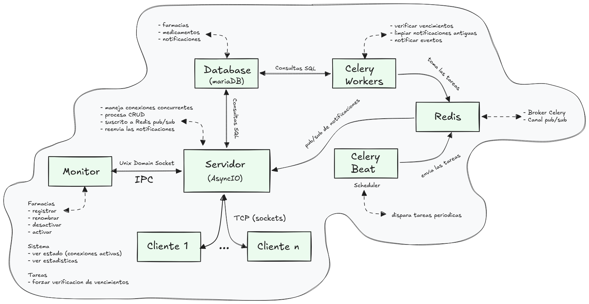

# PharmaNotify

PharmaNotify es un sistema de gestión de inventario farmacéutico que notifica automáticamente a las farmacias sobre medicamentos próximos a vencer. Cada farmacia se conecta al servidor y gestiona su inventario en tiempo real, mientras que un proceso de fondo revisa periódicamente las fechas de vencimiento y genera alertas de forma automática.

El sistema tiene dos roles: las **farmacias**, que usan el cliente CLI para gestionar su inventario, y el **administrador**, que usa el monitor para gestionar las farmacias registradas y supervisar el estado del sistema.



---

## Conectarse como farmacia

Para que una farmacia pueda conectarse, primero tiene que estar registrada por el administrador desde el monitor. Si el nombre no está registrado, el servidor rechaza la conexión.

**En entorno local:**
```bash
python -m src.client.client --farmacia "Nombre de tu farmacia"
```

**Con Docker:**
```bash
docker compose run --rm client --farmacia "Nombre de tu farmacia"
```

Los argumentos `--host` y `--puerto` son opcionales. Solo son necesarios si el servidor no está corriendo en `localhost` o no usa el puerto por defecto (9999).

Al conectarse, el servidor envía automáticamente un resumen de estado con la cantidad de medicamentos activos, notificaciones no leídas, y medicamentos que vencieron mientras la farmacia estuvo desconectada.

---

## Menú del cliente

Una vez conectada, la farmacia opera a través de un menú interactivo. En cualquier operación que pida datos se puede escribir `cancelar` para volver al menú sin ejecutar nada.

**1. Crear medicamento** — registra un nuevo medicamento en el inventario con su código, nombre y fecha de vencimiento. El código debe ser único dentro de la farmacia.

**2. Listar medicamentos** — muestra todos los medicamentos activos del inventario con su información completa.

**3. Buscar medicamento** — busca un medicamento por su código y muestra sus datos.

**4. Actualizar medicamento** — modifica los datos de un medicamento existente. Solicita confirmación antes de ejecutar el cambio.

**5. Eliminar medicamento** — realiza una eliminación lógica del medicamento (queda registrado en la base de datos con estado inactivo). Solicita confirmación antes de ejecutar.

**6. Ver notificaciones** — muestra el historial de notificaciones recibidas y las marca como leídas.

**7. Configurar umbral de alertas** — define con cuántos días de anticipación el sistema debe generar alertas antes de que un medicamento venza. Por defecto son 7 días. Por ejemplo, con un umbral de 10, el sistema avisa cuando quedan 10 días o menos para el vencimiento.

**8. Ver resumen de estado** — muestra nuevamente el resumen que se envió al conectarse: medicamentos activos, notificaciones no leídas, y vencidos durante la ausencia.

**9. Salir** — cierra la conexión con el servidor de forma ordenada.

---

## Notificaciones en tiempo real

El sistema puede enviar tres tipos de notificaciones que aparecen en pantalla mientras la farmacia está conectada.

Las **notificaciones de eventos CRUD** se generan automáticamente al crear, actualizar o eliminar un medicamento, confirmando que la operación quedó registrada en el sistema.

Las **alertas de vencimiento próximo** son generadas por el proceso de fondo (Celery Beat) cuando un medicamento entra dentro del período de alerta configurado. La frecuencia de verificación la define el administrador.

Los **medicamentos vencidos durante la ausencia** se informan automáticamente en el resumen de estado al reconectarse, si algún medicamento venció mientras la farmacia estuvo desconectada.

> Las notificaciones pueden aparecer mientras el usuario está interactuando con el menú. Esto es una limitación conocida del diseño actual: ambas corrutinas (menú y escucha del servidor) comparten la misma terminal. El mensaje llega correctamente, aunque puede interrumpir visualmente la entrada en curso.

---

## Usar el monitor (administrador)

El monitor es la herramienta de administración del sistema. Las farmacias **solo pueden ser registradas desde el monitor** — no existe auto-registro. Esto evita que errores de tipeo generen registros incorrectos en la base de datos.

**En entorno local:**
```bash
python -m src.monitor.monitor
```

**Con Docker:**
```bash
docker compose run --rm monitor
```

El monitor se comunica con el servidor a través de un Unix Domain Socket. Si el servidor no está corriendo cuando intentás abrir el monitor, el sistema mostrará un mensaje de error indicando que no se encontró el socket.

**Farmacias:** el monitor permite registrar nuevas farmacias, listarlas con su estado completo, renombrarlas, desactivarlas (lo que cierra su conexión activa si estaban conectadas) y reactivarlas. Todas las operaciones destructivas solicitan confirmación antes de ejecutarse.

**Sistema:** podés consultar qué farmacias están conectadas en este momento y ver estadísticas generales del sistema como cantidad de medicamentos activos, próximos a vencer, y notificaciones generadas hoy.

**Tareas:** podés forzar la ejecución inmediata de la verificación de vencimientos o de la limpieza de notificaciones antiguas, sin esperar al próximo ciclo programado de Celery Beat.