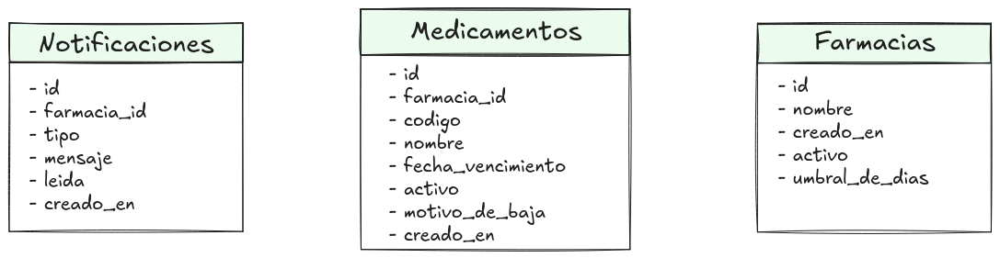

# INFO — Decisiones de diseño

Este documento justifica las decisiones de diseño más relevantes del sistema PharmaNotify. Cada sección explica qué se eligió, qué alternativas existían, y por qué la opción elegida es la más adecuada para el problema que resuelve este sistema.

---

## AsyncIO en el servidor en lugar de threads

El servidor necesita manejar múltiples farmacias conectadas simultáneamente mientras escucha comandos del monitor por IPC y espera notificaciones de Redis. La pregunta de diseño es cómo manejar esa concurrencia.

La alternativa más inmediata sería usar threads: un thread por cliente conectado. Esto funciona, pero tiene un costo. Cada thread del sistema operativo consume memoria  y tiempo de CPU para el cambio de contexto. Si el sistema escalara a cientos de farmacias simultáneas, el overhead de gestionar cientos de threads se volvería el cuello de botella, no la lógica de negocio.

El problema que resuelve el servidor es fundamentalmente de I/O: espera que el cliente mande un mensaje, espera que la base de datos responda, espera que Redis publique una notificación. El procesador no está haciendo trabajo intensivo, está esperando. Este es exactamente el escenario para el que AsyncIO fue diseñado: concurrencia cooperativa donde las corrutinas ceden el control mientras esperan I/O, permitiendo que el mismo thread atienda miles de conexiones en paralelo.

En la práctica, el servidor implementa tres corrutinas concurrentes dentro del mismo event loop: `manejar_cliente` para las conexiones TCP de las farmacias, `escuchar_monitor_ipc` para los comandos del administrador, y `escuchar_notificaciones_redis` para el canal pub/sub. Las tres conviven sin bloquearse mutuamente porque ninguna monopoliza el CPU — cada una cede control en cada operación de I/O con `await`.

---

## Celery para tareas en background en lugar de threads o procesos manuales

La verificación periódica de vencimientos y la limpieza de notificaciones antiguas son tareas que no deben ejecutarse dentro del proceso del servidor. Si se ejecutaran ahí, podrían competir con el event loop de AsyncIO y degradar la respuesta a los clientes conectados.

La solución podría haber sido lanzar un thread separado dentro del mismo proceso, o un proceso Python independiente con un loop de `time.sleep()`. Ambas opciones funcionan para un sistema pequeño, pero tienen limitaciones importantes: no tienen reintentos automáticos ante fallos, no tienen observabilidad de qué tareas se ejecutaron y cuándo, y no escalan a múltiples workers si el volumen de trabajo aumenta.

Celery resuelve todos estos problemas. Las tareas son unidades de trabajo independientes que se encolan en Redis y se ejecutan en procesos worker separados del servidor. Si una tarea falla (por ejemplo, la base de datos no está disponible temporalmente), `self.retry()` la reintenta automáticamente con los parámetros configurados. Celery Beat actúa como el scheduler que dispara las tareas periódicas, reemplazando el `time.sleep()` manual con un mecanismo robusto basado en `crontab`.

La separación también es conceptualmente limpia: el servidor es un coordinador de I/O en tiempo real, y los workers son procesadores de trabajo en background. Cada uno hace lo que mejor sabe hacer.

---

## Redis cumpliendo dos roles distintos

Redis aparece dos veces en la arquitectura del sistema con roles completamente diferentes, y vale la pena explicar por qué esto es una decisión de diseño deliberada y no una casualidad.

El primer rol es como **broker de Celery**: Redis actúa como la cola de mensajes donde el servidor encola tareas (`notificar_evento.delay()`, `verificar_vencimientos.delay()`) y los workers las consumen. Es el intermediario entre quien pide que se haga algo y quien lo hace.

El segundo rol es como **canal pub/sub de notificaciones**: cuando un worker termina de procesar una tarea, publica el resultado en un canal Redis (`REDIS_NOTIFICATIONS_CHANNEL`). El servidor está suscrito a ese canal y reenvía el mensaje al cliente conectado correspondiente.

Estos dos roles son independientes entre sí. El broker usa la lógica de colas de Redis (LPUSH/BRPOP internamente). El pub/sub usa un mecanismo completamente distinto de Redis: los mensajes publicados no persisten, se entregan instantáneamente a todos los suscriptores activos y se descartan. Si no hay nadie suscrito cuando se publica, el mensaje se pierde — pero eso está previsto: la notificación ya fue persistida en la base de datos antes de publicarse en Redis, así que la farmacia la encontrará en su historial cuando consulte.

Usar Redis para ambos roles reduce la complejidad operativa del sistema: una dependencia de infraestructura menos que instalar, configurar, y mantener.

---

## Unix Domain Socket para la comunicación con el monitor

El monitor es un proceso administrativo que corre en la misma máquina que el servidor. La pregunta es cómo comunicarlos.

La opción más obvia sería TCP: el monitor se conecta al servidor por un puerto dedicado, igual que las farmacias. Esto funcionaría, pero tiene una desventaja: ese puerto estaría expuesto en la interfaz de red de la máquina, lo que significa que cualquier proceso con acceso a la red podría intentar conectarse al canal de administración.

Un Unix Domain Socket (UDS) resuelve esto de forma elegante. Es un archivo en el sistema de archivos (`/tmp/pharma_monitor.sock`), y el control de acceso lo manejan los permisos del archivo — el mismo mecanismo que ya usa el sistema operativo para cualquier otro recurso. Si el archivo solo tiene permisos de lectura/escritura para el usuario que corre el servidor, ningún otro proceso puede conectarse al canal administrativo. Además, la comunicación por UDS es más rápida que TCP porque no pasa por el stack de red del sistema operativo.

La implementación en AsyncIO de los dos mecanismos es casi idéntica: `asyncio.start_server()` para TCP y `asyncio.start_unix_server()` para UDS. El mismo código de protocolo con prefijo de longitud funciona para ambos sin modificaciones.

---

## Eliminación lógica en medicamentos y física en notificaciones

El sistema tiene dos políticas de eliminación distintas para dos tipos de datos distintos, y la diferencia es intencional.

Los medicamentos usan **eliminación lógica**: cuando una farmacia elimina un medicamento, el campo `activo` pasa a `FALSE` y se registra el `motivo_baja` (`eliminado_manual` o `vencido_automatico`). El registro sigue existiendo en la base de datos. Esto preserva la historia del inventario — si en el futuro se necesita auditar qué medicamentos pasaron por el sistema, esa información existe. También permite distinguir si un medicamento fue eliminado manualmente por el usuario o fue marcado como vencido automáticamente por Celery.

Las notificaciones leídas con más de `NOTIFICATION_RETENTION_DAYS` días de antigüedad usan **eliminación física**: se borran definitivamente de la base de datos. La justificación es la inversa: una notificación leída y vieja ya cumplió su propósito. No tiene valor histórico que preservar porque la farmacia ya la vio, y acumularlas indefinidamente haría crecer la tabla sin ningún beneficio. La tarea `limpiar_notificaciones_antiguas` corre una vez por día a las 3 AM para mantener la tabla en un tamaño razonable.

---

## Registro de farmacias exclusivo del monitor

Las farmacias no pueden auto-registrarse. Si un cliente intenta conectarse con un nombre que no existe en la base de datos, el servidor rechaza la conexión inmediatamente.

Esta restricción responde a un problema práctico concreto: si el auto-registro estuviera habilitado, un error de tipeo al conectarse crearía un registro nuevo en la base de datos con el nombre incorrecto. "Farmacia Central" y "farmacia central" y "Farmacia  Central" (con un espacio extra) serían tres entidades distintas, y el inventario de la farmacia real quedaría fragmentado entre ellas.

Al centralizar el registro en el monitor, el administrador es el único que puede crear farmacias, y lo hace deliberadamente con el nombre correcto. El servidor normaliza el nombre recibido del cliente con `strip()` antes de buscarlo, lo que tolera espacios extra accidentales al escribir, pero la farmacia tiene que existir antes de que cualquier cliente pueda conectarse con ese nombre.

---

## Protocolo TCP con prefijo de longitud

TCP es un protocolo de stream: los datos llegan como una secuencia continua de bytes, sin delimitadores entre mensajes. Si el servidor envía dos mensajes seguidos rápidamente, el cliente podría recibirlos concatenados en una sola lectura, o podría recibir el primero partido en dos lecturas separadas. Este problema se llama "framing" y cualquier protocolo sobre TCP tiene que resolverlo.

La solución más simple sería usar `\n` como delimitador de mensajes. Funciona si los mensajes nunca contienen saltos de línea, pero es frágil ante datos arbitrarios.

La solución elegida es el prefijo de longitud: cada mensaje se envía precedido por 4 bytes (big-endian, unsigned int) que indican exactamente cuántos bytes tiene el payload. El receptor lee primero esos 4 bytes, sabe exactamente cuántos bytes leer a continuación, y puede reconstruir el mensaje correctamente sin importar cómo llegaron particionados. `struct.pack("!I", longitud)` serializa el entero en los 4 bytes, y `asyncio.StreamReader.readexactly()` garantiza que se lean exactamente esa cantidad antes de continuar.

Este mecanismo está implementado en `shared/protocol.py` y es el único punto del código que entiende de bytes crudos. Tanto el cliente como el servidor trabajan exclusivamente con diccionarios Python, delegando la serialización y el framing al protocolo.

---

## Arquitectura en capas y patrón repositorio

El servidor no contiene ninguna consulta SQL. Toda operación sobre la base de datos pasa por la capa de repositorios en `infrastructure/repositories/`, que es la única que conoce el esquema de las tablas y construye las queries.

Esta separación tiene un beneficio concreto: si en el futuro el motor de base de datos cambiara (por ejemplo, de MariaDB a PostgreSQL), el cambio estaría acotado a los repositorios. El servidor, el cliente, y los workers no se enterarían.

También hay una separación entre conexiones síncronas y asíncronas que refleja la naturaleza de los dos contextos de ejecución del sistema. El servidor usa `aiomysql` para conexiones asíncronas que no bloquean el event loop de AsyncIO. Los workers de Celery no tienen event loop, así que usan `PyMySQL` para conexiones síncronas. Ambos tipos de conexión se crean en `infrastructure/clients/database.py`, que es el único lugar donde se conocen los detalles de conexión a la base de datos.